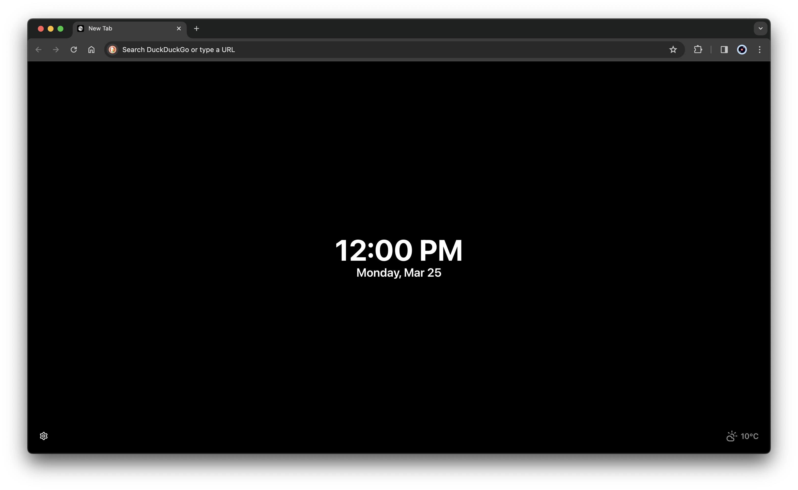

<h1 align="center">Taboo</h1>

  Modern and simple tab replacement for Chrome, Firefox, and Edge.

  <a href="#introduction"><strong>Introduction</strong></a> ·
  <a href="#built-with"><strong>Built with</strong></a> ·
  <a href="#downloads"><strong>Downloads</strong></a> ·
  <a href="#development"><strong>Development</strong></a> ·
  <a href="#license"><strong>License</strong></a>

## Introduction

Taboo is a browser extension that replaces the default new tab page with a flat
and distraction-free design.

## Built with

- [Plasmo Framework](https://plasmo.com)
- [Tailwind CSS](https://tailwindcss.com)

## Downloads

- Chrome Web Store (pending review)
- [Firefox Addon Store](https://addons.mozilla.org/en-US/firefox/addon/taboo)

## Development

To run the extension locally, clone this repository, install dependencies by
running `pnpm install` in the project root, then run `pnpm dev` and
[load the extension](https://docs.plasmo.com/framework#loading-the-extension-in-chrome).

To build the extension run `pnpm build`, see more about creating a production
build [here](https://docs.plasmo.com/framework/workflows/build).

## License

This project is licensed under the MIT License. See [`LICENSE`](/LICENSE) for more
information.
